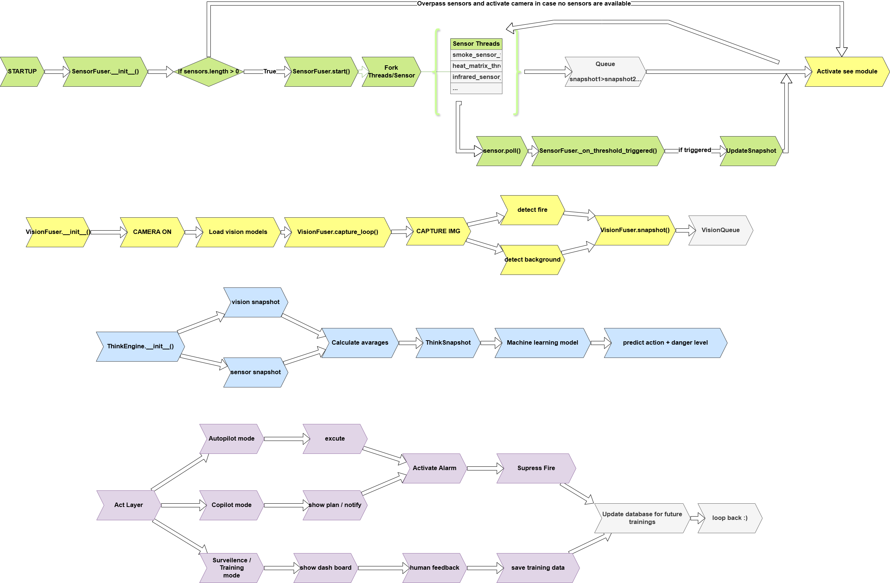
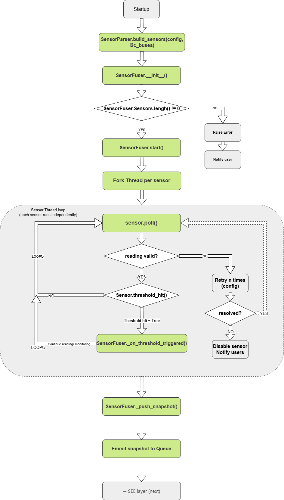
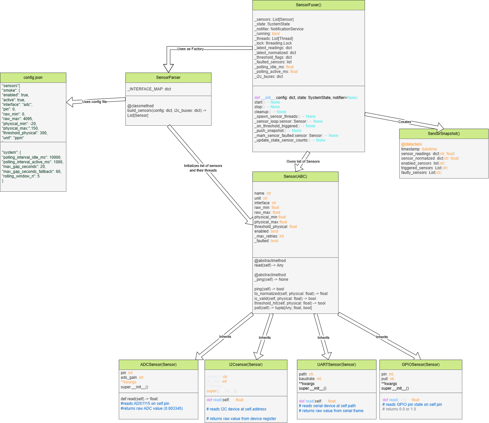
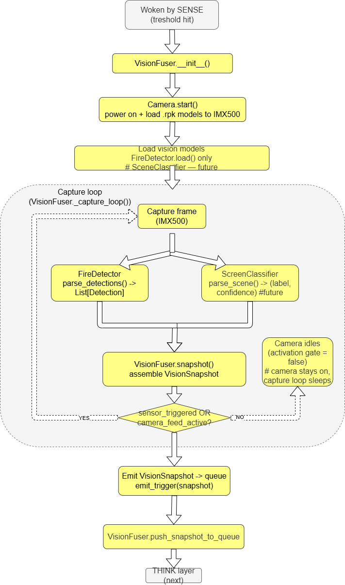
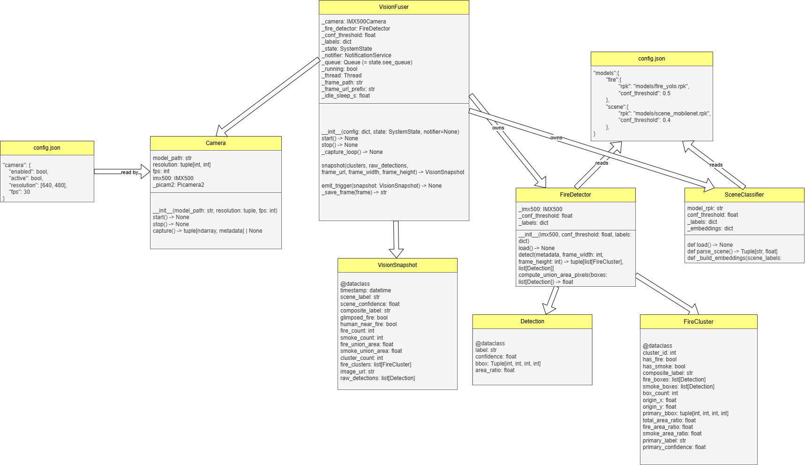
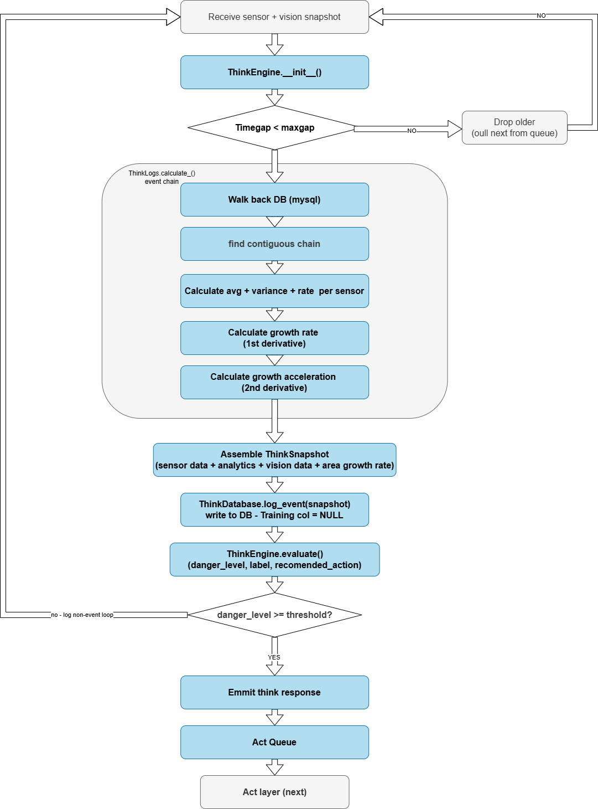
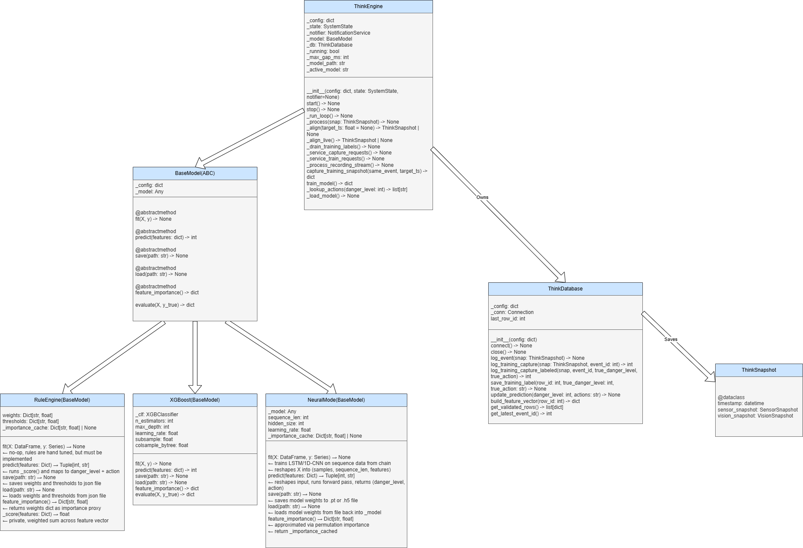
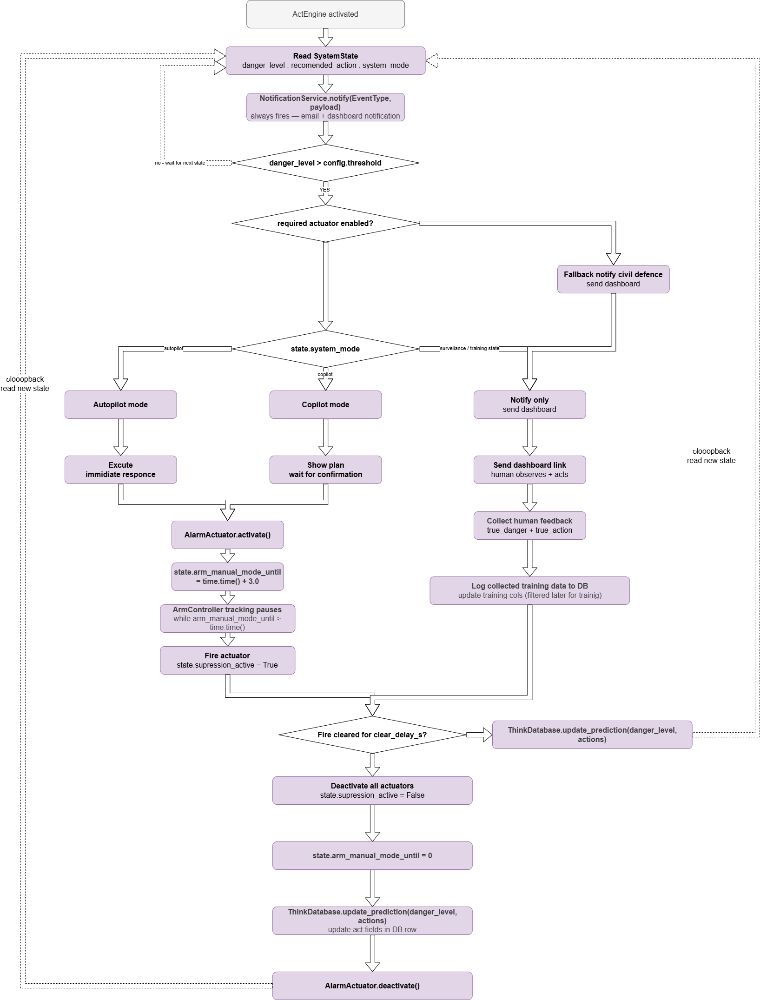
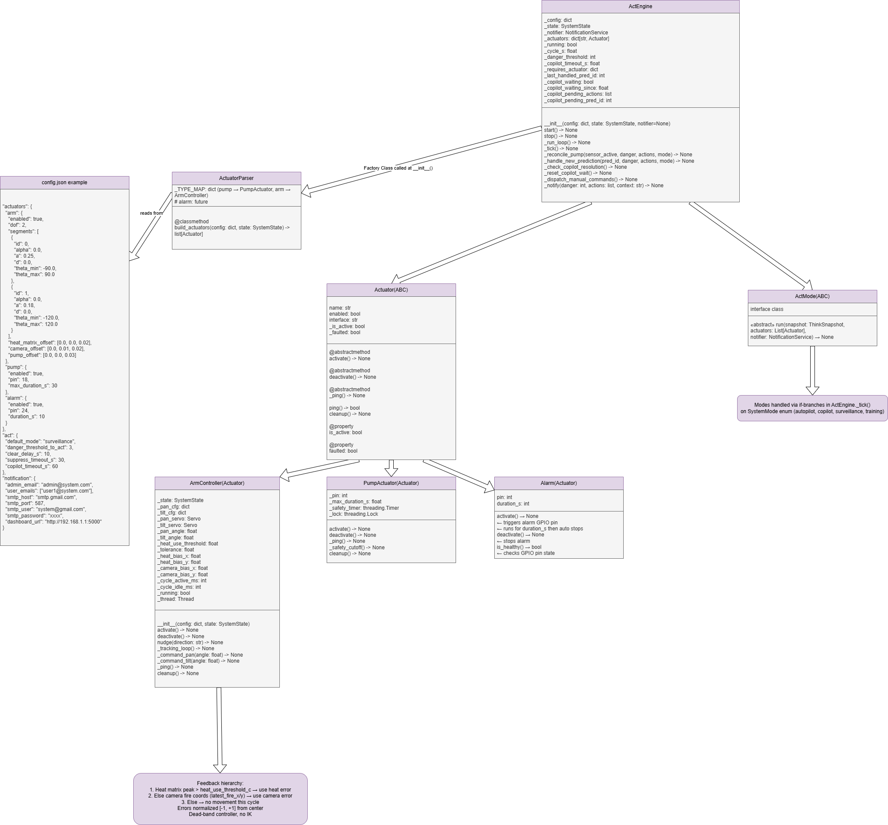

# Fire Detection and Response System — Architecture

**Version:** 0.3.1 (implementation in progress)
**Status:** Implementation in progress
**Author:** Maya Fakih
**Database:** PostgreSQL — JSONB columns handle variable sensor configurations so schema stays fixed regardless of hardware setup.

---

## Table of Contents

1. [System Overview](#1-system-overview)
2. [System Pipeline](#2-system-pipeline)
3. [SystemOrchestrator and SystemState](#3-systemorchestrator-and-systemstate)
4. [SENSE Layer](#4-sense-layer)
5. [SEE Layer](#5-see-layer)
6. [THINK Layer](#6-think-layer)
7. [ACT Layer](#7-act-layer)
8. [Database Schema](#8-database-schema)
9. [Configuration Reference](#9-configuration-reference)
10. [Integration Contracts](#10-integration-contracts)
11. [Future Plans](#11-future-plans)
12. [Website and IoT Control](#12-website-and-iot-control)
13. [Module Reusability Boundary](#13-module-reusability-boundary)

---

## 1. System Overview

This system is a multi-layer intelligent fire detection and response platform designed for embedded deployment on a Raspberry Pi with attached sensors, camera module, and a 2-DOF robotic arm. It is capable of detecting fire using both physical sensors and computer vision, reasoning about the severity and growth rate of a detected event, and dispatching appropriate responses ranging from notification to physical suppression — all while continuously learning from human feedback to improve its decision-making over time.

The system is designed to be context-aware. Thresholds, actuator mappings, action spaces, and operating modes are all configurable through a single `config.json` file, allowing the same codebase to be deployed in a data centre (where any heat anomaly is critical) or a wildfire monitoring site (where much higher tolerances apply) without code changes.

The system is designed to be deployment-agnostic. It has no assumptions about its physical platform — it only knows what it sees through its camera and what its sensors report. Whether it is mounted on a fixed wall, a robotic arm, or a drone, the pipeline is identical. Physical platform awareness (spatial coordinates, movement, encoder feedback) is a future extension, not a core dependency.

The architecture is divided into four logical processing layers that run as independent operating system processes, coordinated through a shared state object managed by a `SystemOrchestrator`.

---

## 2. System Pipeline

The four layers form a left-to-right pipeline. Each layer produces a well-defined output that the next layer consumes. No layer reaches across layer boundaries except through these agreed contracts.

```
SENSE  ──►  SEE  ──►  THINK  ──►  ACT
```

| Layer | Color convention | Primary output |
|-------|-----------------|----------------|
| SENSE | Green  | `SensorSnapshot` → `sense_queue` |
| SEE   | Yellow | `VisionSnapshot` → `see_queue` |
| THINK | Blue   | DB row + `danger_level` / `action` written to `SystemState` |
| ACT   | Purple | Physical actuator commands + notifications |

### Top-level pipeline flowchart



> Note: At runtime all four layers operate concurrently as separate processes. SENSE and SEE communicate to THINK via queues. THINK communicates to ACT via SystemState — no think_queue or act_queue exists.

---

## 3. SystemOrchestrator and SystemState

### 3.1 Role of the Orchestrator

The `SystemOrchestrator` is the entry point of the entire system. It is responsible for:

- Reading `config.json` at boot and parsing it into a config dict
- Creating the `multiprocessing.Manager` and constructing `SystemState`
- Instantiating all four layer components and passing them the parsed config dict and a reference to `SystemState`
- Calling `start()` on each component, which causes each to spawn its own OS process
- Accepting mode change requests from the website and writing them to `SystemState`
- Shutting down all processes gracefully on system exit

The orchestrator does not manage the internal logic of any layer. It is a boot manager and a mode switcher. Each layer is self-managing.

Each layer that needs the database creates its own connection directly. SystemState does not mediate database access.

Config values (thresholds, model paths, gap settings) are private to each layer. They are read from the config dict at layer init and never placed in SystemState. SystemState carries runtime control signals only — not configuration.

### 3.2 SystemState — the shared blackboard

SystemState carries control signals only. Data between SENSE and THINK travels via `sense_queue`. Data between SEE and THINK travels via `see_queue`. THINK writes its output (danger level + action) directly to SystemState for ACT to read — no think_queue or act_queue exists.

A strict ownership rule applies: each field in `SystemState` has exactly one writer. No two processes write to the same field. All fields are backed by a `multiprocessing.Manager` dict so writes are visible across OS processes.

| Field | Type | Written by | Read by |
|-------|------|-----------|---------|
| `sensor_triggered` | bool | SensorFuser | VisionFuser, ThinkEngine |
| `active_sensor_count` | int | SensorFuser | Orchestrator, NotificationService |
| `faulted_sensors` | List[dict] | SensorFuser | NotificationService |
| `system_mode` | SystemMode | SystemOrchestrator | All layers |
| `system_running` | bool | SystemOrchestrator | All layers |
| `sense_running` | bool | SensorFuser | Orchestrator, ThinkEngine |
| `see_running` | bool | VisionFuser | Orchestrator, ThinkEngine |
| `think_running` | bool | ThinkEngine | Orchestrator |
| `act_running` | bool | ActEngine | Orchestrator |
| `camera_feed_active` | bool | SystemOrchestrator | VisionFuser |
| `db_connected` | bool | ThinkEngine | Dashboard |
| `danger_level` | int | ThinkEngine | ActEngine |
| `recommended_action` | str | ThinkEngine | ActEngine |
| `training_label_queue` | Queue | API (via Orchestrator) | ThinkEngine |
| `training_capture_request` | Queue | API (via Orchestrator) | ThinkEngine |
| `training_capture_response` | Queue | ThinkEngine | API (via Orchestrator) |
| `train_request` | Queue | API (via Orchestrator) | ThinkEngine |
| `train_response` | Queue | ThinkEngine | API (via Orchestrator) |
| `training_recording` | bool | API (via Orchestrator) | ThinkEngine |
| `training_event_id` | int | Orchestrator | ThinkEngine, API |
| `training_label_stream` | Queue | API (via Orchestrator) | ThinkEngine (peek-not-pop) |

`faulted_sensors` entries must be dicts with `name` and `faulted_at` keys — enforced by the setter.

The three `training_*` queues carry the training-mode website→THINK traffic (see §6.7.1). `sense_running` / `see_running` are read by ThinkEngine so a faulted layer does not stall alignment — THINK proceeds with that side as `None` rather than waiting on an empty queue.

`danger_level` accepts 0–5. 0 means no prediction yet (system just started).

**`danger_level` and `recommended_action` rules:**
- Written by ThinkEngine after every successful prediction cycle.
- Read once per iteration by ActEngine — not polled continuously.
- ACT reads them, executes, then waits for the next update. This prevents acting on stale data.
- These are the only signals THINK passes to ACT. No queue between them.

**`camera_feed_active` rules:**
- Set to `True` only when the user explicitly opens the Camera Feed tab on the website.
- `SystemOrchestrator` is the sole writer via `set_camera_feed(active: bool)`.
- `VisionFuser` activates when `sensor_triggered = True` OR `camera_feed_active = True`.

**`db_connected` rules:**
- Set to `True` by ThinkEngine when `ThinkDatabase.connect()` succeeds.
- Set to `False` if connection fails after retries, or if a DB operation fails mid-run.
- Read by the dashboard to display database status.

**Queues** — owned by SystemState, only two exist:

| Queue | From | To |
|-------|------|----|
| `sense_queue` | SensorFuser | ThinkEngine |
| `see_queue` | VisionFuser | ThinkEngine |

### 3.3 Process activation rules

| Process | Activates when | Deactivates when |
|---------|---------------|-----------------|
| SensorFuser | always on from boot | `system_running = False` |
| VisionFuser | `sensor_triggered = True` OR `camera_feed_active = True` | both flags False |
| ThinkEngine | `sensor_triggered = True` AND snapshots available in queues | `sensor_triggered = False` |
| ActEngine | `danger_level` updated in SystemState | `system_running = False` |

### 3.4 SystemOrchestrator class

```
SystemOrchestrator
  fields:
    _config: dict
    _manager: Manager
    _state: SystemState
    _sensor_fuser: SensorFuser
    _vision_fuser: VisionFuser
    _think_engine: ThinkEngine
    _act_engine: ActEngine
    _notifier: NotificationService

  methods:
    __init__(config_path: str) → None
    start() → None
    stop() → None
    set_mode(mode: str) → None
    set_camera_feed(active: bool) → None
    restart_layer(layer_name: str) → None   (not yet implemented)
```

---

## 4. SENSE Layer

The SENSE layer is responsible for reading all physical sensors, validating their readings, detecting threshold crossings, and emitting `SensorSnapshot` objects to `sense_queue` for THINK to consume. It runs continuously from system boot.

### 4.1 Flowchart



### 4.2 UML class diagram



### 4.3 Design principles

Every sensor type (ADC, I2C, UART, GPIO) inherits from `Sensor(ABC)`. `SensorFuser` calls `poll()` on each one without knowing what kind of sensor it is. `SensorParser` reads the config dict at startup and constructs the correct concrete subclass — this is the only place sensor types are branched on.

Each sensor runs in its own thread inside the SensorFuser process. When any threshold is crossed, SensorFuser assembles a `SensorSnapshot`, puts it in `sense_queue`, and writes `sensor_triggered = True` to `SystemState`.

### 4.4 Fault handling

When a sensor produces an invalid reading it retries up to `max_retries` times, then marks itself as faulted and removes itself from the active pool. SensorFuser updates `faulted_sensors` and `active_sensor_count` in SystemState and calls NotificationService immediately. The system continues with remaining healthy sensors.

### 4.5 Dataclasses

```python
@dataclass
class SensorSnapshot:
    timestamp: datetime
    sensor_readings: dict[str, float]    # sensor_name → physical value
    sensor_normalized: dict[str, float]  # sensor_name → 0.0–1.0
    enabled_sensors: list[str]
    disabled_sensors: list[str]          # faulted + disabled from config
    triggered_sensors: list[str]         # sensors that crossed threshold
    faulty_sensors: list[str]            # sensors that faulted this cycle
```

### 4.6 Class summary

- `Sensor(ABC)` — base class: `read()`, `to_physical()`, `to_normalized()`, `threshold_hit()`, `poll()`, `ping()`, `read_specific values()`
- `ADCSensor(Sensor)` — reads ADS1115 via pin
- `I2CSensor(Sensor)` — reads I2C device by address
- `UARTSensor(Sensor)` — reads serial device by path
- `GPIOSensor(Sensor)` — reads GPIO pin, returns 0.0 or 1.0
- `SensorFuser` — owns all sensors, runs polling threads, emits SensorSnapshot
- `SensorParser` — factory: reads config, builds correct sensor subclass per entry

### 4.7 Config reference (SENSE section)

```json
"sensors": {
  "smoke": {
    "enabled": true, "interface": "adc", "pin": 0,
    "raw_min": 0, "raw_max": 4095,
    "physical_min": 0, "physical_max": 1000,
    "threshold_physical": 300, "unit": "ppm",
    "valid_min": 0, "valid_max": 1000, "max_retries": 3
  }
},
"system": {
  "polling_interval_idle_ms": 10000,
  "polling_interval_active_ms": 1000
}
```

### 4.8 Sensor read function

Since each sensor is different we need a way to understand their correct transformation function from raw data to human form physical data. To allow for the flexibility of the system the config file should include the read method for each sensor.

Example inlcudes but is not limited to the adc model where we can use python's ability to read strings and convert them to equations. For other models we can have configured multiple functions for different reading types in the class as read_i2c_normal or whatever with describtive names that can be set in the config file, and then these functions will be called in read based on the correct configuration.

### 4.9 Sensor ping function

Sensor ping is a test that checks if we can read from the hardware to ensure that the system can actually connect the hardware, it can flag issues like wrong pin configuration in config, burnt IO on the pi, or a wrong sensor.

The ping is different for different types sure costumize for each of the 4 sensor time.

---

## 5. SEE Layer

The SEE layer handles all computer vision. It is off when sensors are below threshold and activates when `sensor_triggered = True` or `camera_feed_active = True`.

The IMX500 camera performs inference on-chip using `.rpk` model packages. Two models run per frame: a YOLO fire detector and a MobileNetV3 scene classifier.

### 5.1 Flowchart



### 5.2 UML class diagram



### 5.3 Design principles

`FireDetector` and `SceneClassifier` both inherit from `VisionModel(ABC)`. `VisionFuser` owns the camera and both models. The clustering algorithm groups spatially proximate fire/smoke boxes into `FireCluster` objects sorted descending by `danger_score = primary_confidence × total_area_ratio`. Index 0 is always the most dangerous cluster.

When running in live stream mode only (`camera_feed_active = True` but `sensor_triggered = False`), VisionFuser streams frames to the website but does NOT emit VisionSnapshot to `see_queue`. The live feed is served from a single rolling buffer file, `data/frames/stream.jpg`, which `_save_frame()` overwrites every frame whenever `camera_feed_active` is True. The write is atomic (write to a temp file, then `os.replace`) so a reader never sees a torn frame. This `stream.jpg` buffer is independent of the timestamped permanent frames tied to logged events.

### 5.4 Dataclasses

```python
@dataclass
class Detection:
    label: str
    confidence: float
    bbox: tuple[int, int, int, int]  # x, y, w, h in normalized 0-1 range
    area_ratio: float

@dataclass
class FireCluster:
    cluster_id: int
    origin_x: float
    origin_y: float
    total_area_ratio: float
    fire_area_ratio: float
    smoke_area_ratio: float
    primary_label: str
    primary_confidence: float
    primary_bbox: tuple[int, int, int, int]
    box_count: int
    has_fire: bool
    has_smoke: bool
    # danger_score = primary_confidence × total_area_ratio
    # index 0 = most dangerous

@dataclass
class VisionSnapshot:
    timestamp: datetime
    scene_label: str
    scene_confidence: float
    composite_label: str        # "fire-smoke" | "fire" | "smoke" | "none"
    glimpsed_fire: bool
    human_near_fire: bool
    fire_count: int
    smoke_count: int
    fire_union_area: float
    smoke_union_area: float
    cluster_count: int
    dominant_cluster_idx: int   # always 0
    fire_clusters: list         # List[FireCluster], ordered by danger_score desc
    frame_image_url: str
    raw_detections: list        # List[Detection]
```

### 5.5 Class summary

- `VisionModel(ABC)` — base: `load()`
- `FireDetector(VisionModel)` — YOLO inference, cluster building
- `SceneClassifier(VisionModel)` — MobileNetV3 scene classification
- `IMX500Camera` — camera lifecycle, on-chip inference
- `VisionFuser` — owns camera and models, emits VisionSnapshot to `see_queue`

Note: SEE writes latest_fire_x, latest_fire_y to SystemState in normalized [0, 1] with (0.5, 0.5) being image center.


### 5.6 Config reference (SEE section)

```json
"vision": {
  "camera": { "enabled": true, "resolution": [640, 480], "fps": 30 },
  "models": {
    "fire": { "rpk": "models/fire_yolo.rpk", "conf_threshold": 0.5,
              "glimpse_threshold": 0.2, "proximity_threshold": 80 },
    "scene": { "rpk": "models/scene_mobilenet.rpk", "conf_threshold": 0.4 }
  },
  "storage": {
    "frame_image_backend": "local",
    "frame_image_path": "frames/",
    "frame_image_url_prefix": "http://192.168.1.1:5000/frames/"
  },
  "labels": "configs/labels.json"
}
```

---

## 6. THINK Layer

The THINK layer is the analytical core. It aligns sensor and vision snapshots, persists them to the database, computes a feature vector from the event chain, runs XGBoost to predict danger level, looks up the corresponding action from config, and writes both to SystemState for ACT to read.

THINK does not communicate with ACT via a queue. It writes to SystemState and the DB. ACT reads from SystemState.

THINK can operate with SENSE only, SEE only, or both — controlled by `enabled` flags in `config.json`.

### 6.1 Flowchart



### 6.2 UML class diagram



### 6.3 ThinkEngine loop — one cycle

The loop behaves differently depending on `system_mode`. There are two paths:
the **prediction path** (autopilot / copilot / surveillance) and the
**training path**.

**Prediction path (one cycle):**

1. Drain the training-label queue (no-op outside training mode if empty).
2. Pull `SensorSnapshot` from `sense_queue` and `VisionSnapshot` from `see_queue`. The loop does **not** gate on `sensor_triggered` — whether SEE produces snapshots is SEE's concern, not THINK's. THINK only waits until it has data to align. If a layer is faulted (`sense_running` / `see_running` is False), THINK does not wait on that layer's queue — it aligns with that side as `None`.
3. Check timestamp gap < `max_gap_ms` — raise `AlignmentError` if exceeded, ThinkEngine catches and skips cycle.
4. Create `ThinkSnapshot` (thin alignment object). If both snapshots are None, return None and skip.
5. Call `ThinkDatabase.log_event(snap)` — DB writes the row and immediately assigns `event_id` internally. ThinkEngine never sees or handles a row ID.
6. Call `ThinkDatabase.build_feature_vector(last_row_id)` → walks back DB chain bounded by `chain_length`, returns feature dict.
7. Pass feature dict to `XGBoostModel.predict()` → returns `danger_level` (int 1–5). Returns 1 (MINIMAL) as safe default when feature dict is empty.
8. Lookup `recommended_action` from `poa_map` in config.
9. Call `ThinkDatabase.update_prediction(danger_level, action)`.
10. Write `danger_level` + `recommended_action` to SystemState. Repeat.

**Training path (one cycle):**

In training mode the loop does **not** consume `sense_queue` / `see_queue` and does **not** predict. The human drives the system through the website; the loop only:

1. Drains the training-label queue — for each `{row_id, true_danger_level, true_action}`, calls `ThinkDatabase.save_training_label(...)`.
2. Services capture requests — for each `{request_id, same_event}` on `training_capture_request`, runs `capture_training_snapshot()` and pushes the result onto `training_capture_response` tagged with the same `request_id`.

This split exists because in training mode the API process must own the capture round-trip and THINK must not also consume the queues — see §6.8.

### 6.4 ThinkSnapshot

ThinkSnapshot is a short-lived alignment object. It is created once per cycle, used to write the DB row, and discarded. It does not accumulate ACT fields, outcome fields, or training fields — those live only in the DB.

```python
@dataclass
class ThinkSnapshot:
    timestamp: datetime
    sensor_snapshot: SensorSnapshot
    vision_snapshot: VisionSnapshot
```

ThinkEngine never holds or passes row IDs. `ThinkDatabase` stores `last_row_id` internally and all subsequent calls in the same cycle use it automatically.

### 6.5 Event chain and feature vector

`ThinkDatabase` assigns `event_id` atomically at the end of every `log_event()` call — ThinkEngine is not involved. The logic: look at the previous row in the DB. If its timestamp is within `max_event_gap_ms` of the current row, inherit its `event_id` (same event continues). If not, or if there is no previous row, use the current row's own `id` as the new `event_id` (new event starts here).

> **Two distinct gap thresholds — do not confuse them.** `max_gap_ms` (small, ~500ms) is *only* the SENSE↔SEE snapshot alignment tolerance — it covers hardware delay between the two layers producing a reading for the same moment. `max_event_gap_ms` (large, seconds) is the quiet-period threshold that separates one fire *event* from a brand-new one. An earlier edit collapsed these into a single value by mistake; they are now separate config keys. Event grouping must use `max_event_gap_ms`.

`build_feature_vector(row_id)` walks back from the given `row_id` (not `_last_row_id`) so it works for both live prediction and offline training over historical rows. It fetches the last N rows of the event ending at `row_id`, where N is `chain_length` from config. From this bounded chain it computes:

For each sensor in the canonical sensor list (locked at startup from `config["sensors"]` keys):
- `latest` — current normalized reading
- `avg` — mean across chain
- `variance` — variance across chain
- `velocity` — first derivative (Δvalue / Δtime)
- `acceleration` — second derivative (Δvelocity / Δtime)

For vision fields (latest row + chain velocities):
- Latest row scalars: `fire_count`, `smoke_count`, `cluster_count`, `fire_union_area`, `smoke_union_area`, `scene_confidence`
- Booleans encoded as 0.0/1.0: `glimpsed_fire`, `human_near_fire`
- Chain velocities: `fire_union_area_velocity`, `smoke_union_area_velocity`

Categorical fields (`composite_label`, `scene_label`) are integer-encoded using maps from config before being added to the vector.

**Missing data is encoded as `np.nan` everywhere** — XGBoost handles NaN natively and learns missingness as a signal. Specifically:
- Faulted or disabled sensor in a cycle → that sensor's reading is NaN for that row
- Chain length < 2 → velocity is NaN (cannot be computed)
- Chain length < 3 → acceleration is NaN (cannot be computed)
- Vision-absent row (sense-only mode) → all vision features are NaN

The final output is a flat `dict[str, float]` passed directly to XGBoost. Nothing in this dict is stored in the DB — recomputed on demand every cycle. For training export, `build_feature_vector(row_id)` is called on each validated row and assembled into a CSV.

> **Current status:** Event chain assignment, retrieval, and feature vector computation are fully implemented. Heat matrix sensors are currently treated as scalar (max value) — full aggregation strategy (mean, variance, hotspot count) deferred until SENSE layer decides whether to aggregate at the sensor level or pass arrays through.

### 6.6 Machine learning

**Phase 1 — RuleEngine** (not yet implemented)
Hand-tuned weighted scoring across the feature vector. Weights stored in `rule_weights.json`, editable from website.

**Phase 2 — XGBoostModel** (current implementation)
`XGBClassifier` trained on validated DB rows. Predicts `danger_level` (classes 1–5) only. Action is always a `poa_map` lookup — XGBoost never predicts actions directly. Hyperparameters loaded from config dict. Returns 1 as safe default when feature dict is empty.

**Phase 3 — NeuralModel** (not yet implemented)
Small LSTM or 1D-CNN operating over the raw chain sequence.

All three implement `BaseModel(ABC)`. Switching phases requires one line change in `config.json`. `BaseModel` provides shared `evaluate()` and `evaluate_per_class()` methods — implemented on the base class, available to all models without duplication.

### 6.7 Offline training flow

Triggered from the website (`POST /api/train`). The system keeps running normally — training does not stop the pipeline.

Implemented as `ThinkEngine.train_model()`, run inside the THINK process (it owns the DB + model). The route reaches it through the orchestrator via a `train_request` / `train_response` queue pair, the same round-trip pattern as training capture. Steps:

1. `ThinkDatabase.get_validated_rows()` — all rows with `validated = TRUE`.
2. `build_feature_vector(row['id'])` per row → feature dict.
3. Assemble `X` and `y = true_danger_level`. **Each `X` row is built as `[vec[k] for k in sorted(vec.keys())]`** — the same `sorted()` that `XGBoostModel.predict()` applies, so training and live-prediction column order are identical. This is the guard for the feature-ordering landmine: `build_feature_vector` returns a dict, and dict insertion order must never be relied on to line up `fit` and `predict`.
4. Train/test split — ratio from `config['think']['training']` (`test_split`, `min_rows_to_train`, `random_state`). Stratified when every class has ≥2 samples.
5. `XGBoostModel.fit(X_train, y_train)`, then `evaluate()` on the test split.
6. `XGBoostModel.save(model_weights_path)`, then hot-swap the model into the running engine.

The route returns sample counts + metrics (accuracy, F1) for the website to display. If there are fewer than `min_rows_to_train` usable rows, `train_model` raises and the route returns `422`.

A separate `ThinkDatabase.export_csv(path)` dumps the raw validated rows to CSV. Note this exports **raw DB columns, not feature vectors** — it is a raw-data dump, not the training matrix. The training matrix is assembled in-memory by `train_model` and is not persisted.

### 6.7.1 Training-mode flow (online labeling)

Section 6.7 covers *offline* training (assembling a CSV and fitting the model from already-validated rows). This section covers how those validated rows are *collected* — the human-in-the-loop labeling that happens in **training mode**.

**Mental model.** Training mode does not halt the system. SENSE keeps polling, SEE keeps producing frames, ACT keeps doing visual-servoing (the arm still tracks heat/fire). What changes is the *decision-maker*: in prediction modes XGBoost produces `danger_level`; in training mode a **human** does. Training mode swaps the decider, nothing else.

**Two flows exist in training mode**, used for different situations:

#### A. Single-shot capture
For one-off labeling. Two API calls:
- `POST /api/training/capture` — body `{target_ts, same_event}`. `target_ts` is the unix-epoch timestamp of the frame the human was looking at when they hit capture. THINK's `_align(target_ts=...)` scans both queues **non-destructively** (drain to a list, search for the closest pair within `max_gap_ms`, restore everything). Live loops downstream — the arm tracking via `SystemState.latest_fire_x/y` — are unaffected. THINK inserts an unlabeled row and returns it.
- `POST /api/training/save` — body `{row_id, danger, action}`. Drops the label on `training_label_queue`; THINK drains and `UPDATE`s the row. 202, never blocks the human.

#### B. Continuous recording (the candle / kitchen / wildfire demos)
For real fire sessions where the human wants to capture a stream of frames with labels that *change over time* (fire grew, bumped 2→3→4 mid-recording). No batch round-trip — labels apply live, rows are written as they stream.

- `POST /api/training/recording/start` — body `{same_event}`. Decides `event_id` once for the whole session, flips `state.training_recording = True`. From this point THINK in training mode consumes `sense_queue`/`see_queue` like the live pipeline (`_align_live`, destructive pop).
- `POST /api/training/recording/label` — body `{danger, action, valid_until}`. Pushes a label onto `training_label_stream`. The label applies to every row whose timestamp is `< valid_until`; when a row's timestamp crosses it, the next label takes over. Labels are reused for many rows. `valid_until=None` = open-ended (applies until a new label arrives).
- `POST /api/training/recording/stop` — flips recording off, drains any unused tail labels.

THINK's recording loop, per iteration: align (live pop) → look up the current label by row timestamp (peek, not pop — `_current_label`) → `log_training_capture_labeled` (one INSERT, label already attached, `validated=TRUE`). If no label is current, the row is dropped rather than written unlabeled (no firehose).

**Event grouping.** A recording = one event. The `same_event` decision is made at `recording/start` and held in `state.training_event_id` for the whole session. Inside the session every row reuses that `event_id`. This gives `build_feature_vector` real chains (velocity/acceleration features have real values), not length-1 chains.

**Why capture goes through THINK and not the API directly.** `_align` and the live DB connection belong to the THINK process. Running them in the API process would mean either duplicating the aligner or having two processes consume `sense_queue`/`see_queue` — a race. So capture is a round trip into the THINK process via the `training_capture_request`/`training_capture_response` queue pair. Save needs no round trip (fire-and-forget). Recording start needs only the event_id round-trip; pushing labels and stopping are one-way flag/queue writes.

Once enough rows have `validated = TRUE`, the offline flow in §6.7 assembles them into a training set and fits the model.

### 6.8 Danger level scale

| Level | Label | Meaning |
|-------|-------|---------|
| 1 | MINIMAL | Logged only, no notification |
| 2 | LOW | Single notification, 15-minute reminder |
| 3 | MODERATE | Notification, ACT enters monitoring state |
| 4 | HIGH | Immediate notification, ACT executes response |
| 5 | CRITICAL | Continuous notification, full ACT response |

The threshold at which ACT activates physical actuators is `danger_threshold_to_act` in `config.json`.

### 6.9 Class definitions

**ThinkEngine**
```
fields:
  _config: dict               received from Orchestrator as parsed dict — never opens config.json itself
  _state: SystemState
  _model: BaseModel
  _db: ThinkDatabase
  _max_gap_ms: int
  _model_path: str
  _active_model: str
  _sense_enabled: bool
  _see_enabled: bool
  _running: bool

methods:
  __init__(config: dict, state: SystemState) → None
  start() → None              connects DB, loads model, starts loop
  stop() → None
  _run_loop() → None          main loop
  _process(snap: ThinkSnapshot) → None
  _align() → ThinkSnapshot | None
  _lookup_action(danger_level: int) → str
  _load_model() → None
```

**ThinkDatabase**
```
fields:
  _config: dict               full config dict, passed in at construction
  _connection
  _connected: bool
  _last_row_id: int           managed internally — ThinkEngine never touches row IDs
  _max_gap_ms: int            read from config["think"]["max_gap_ms"]
  _chain_length: int          read from config["think"]["chain_length"]
  _sensor_list: list[str]     locked at startup from config["sensors"] keys
  _label_encoding: dict       read from config["think"]["label_encoding"]

methods:
  __init__(config: dict) → None
  connect() → None
  close() → None
  log_event(snap: ThinkSnapshot) → None     writes row, calls _assign_event_id() automatically
  _assign_event_id() → None                 private — assigns event_id by comparing timestamp gap to previous row
  update_prediction(danger_level: int, action: str) → None
  update_human_label(true_danger: int, true_action: str = None) → None
  get_event_chain(event_id: int) → list
  get_last_chain() → list
  get_validated_rows() → list
  build_feature_vector(row_id: int) → dict[str, float]   walks back from row_id, bounded by chain_length
  _extract_sensor_series(chain, sensor_name) → tuple[list, list]   private — pulls values+timestamps; defensive list-handling for unaggregated heat matrix
  _extract_vision_series(chain, field) → tuple[list, list]         private — pulls values+timestamps for vision fields
  _safe_velocity(values, timestamps) → float                       private — Δvalue/Δtime, NaN if uncomputable
  _safe_acceleration(values, timestamps) → float                   private — Δvelocity/Δtime, NaN if uncomputable
  _nan_if_none(v) → float                                          private — None → np.nan, preserves real numbers including 0
  export_csv(path: str) → None
  clear_logs() → None
```

**BaseModel (ABC)**
```
methods:
  fit(X, y) → None                         [abstract]
  predict(features: dict) → int            [abstract]   returns danger_level 1–5
  save(path: str) → None                   [abstract]
  load(path: str) → None                   [abstract]
  feature_importance() → dict[str, float]  [abstract]
  evaluate(X, y_true) → dict               accuracy, f1_macro, f1_weighted, precision_macro, recall_macro
  evaluate_per_class(X, y_true) → dict     per-class precision, recall, f1, classes list
```

**XGBoostModel(BaseModel)**
```
fields:
  _model: XGBClassifier
  _n_estimators: int
  _max_depth: int
  _learning_rate: float
  _subsample: float
  _colsample_bytree: float

methods:
  fit(X, y) → None
  predict(features: dict) → int      returns 1 if features empty; XGBoost is 0-indexed → returned as 1–5
  save(path: str) → None             saves as xgboost_model.json
  load(path: str) → None
  feature_importance() → dict        get_booster().get_score(importance_type="weight")
```

**RuleEngine(BaseModel)** — not yet implemented

**NeuralModel(BaseModel)** — not yet implemented

### 6.10 Config reference (THINK section)

```json
"think": {
  "max_gap_ms": 500,
  "chain_length": 5,
  "min_training_rows": 200,
  "active_model": "xgboost",
  "model_weights_path": "model_weights/",
  "xgboost": {
    "n_estimators": 100,
    "max_depth": 4,
    "learning_rate": 0.1,
    "subsample": 0.8,
    "colsample_bytree": 0.8
  },
  "poa_map": {
    "1": "monitor",
    "2": "monitor",
    "3": "alarm",
    "4": "water_suppress",
    "5": "evacuate"
  },
  "label_encoding": {
    "composite_label": { "none": 0, "smoke": 1, "fire": 2, "fire-smoke": 3 },
    "scene_label": { "classroom": 0, "hospital": 1, "kitchen": 2,
                     "warehouse": 3, "office": 4, "server_room": 5,
                     "corridor": 6, "parking_garage": 7 }
  }
}
```

### 6.11 THINK relationships

```
ThinkEngine    ──◆ owns ──►  ThinkDatabase
ThinkEngine    ── uses ───►  BaseModel (swappable)
ThinkEngine    ── writes ──► SystemState.danger_level
ThinkEngine    ── writes ──► SystemState.recommended_action
ThinkEngine    ── writes ──► SystemState.db_connected
ThinkDatabase  ── manages ►  last_row_id (internal)
ThinkDatabase  ── manages ►  event_id assignment (internal, via _assign_event_id)
ThinkDatabase  ── reads/writes ► think_schema table
BaseModel      ◄── XGBoostModel (implemented)
BaseModel      ◄── RuleEngine (not yet implemented)
BaseModel      ◄── NeuralModel (not yet implemented)
ThinkSnapshot  ── contains ► SensorSnapshot + VisionSnapshot
```

---

## 7. ACT Layer

The ACT layer reads `danger_level` and `recommended_action` from SystemState and executes the appropriate physical and notification response. It is the only layer that interacts with external hardware and external parties.

ACT does not receive a queue message from THINK. It polls SystemState once per iteration for updated danger_level and acts on it.

### 7.1 ACT engine flowchart



### 7.2 UML class diagram



### 7.3 Operating modes

**Autopilot** — executes recommended_action immediately, sends report email after.

**Copilot** — sends proposed action to website, waits up to `copilot_timeout_s` for human confirmation, executes on confirm, logs rejection or timeout.

**Surveillance** — no actuators fire. Sends dashboard link, human acts manually.

**Training** — displays ThinkEngine's prediction on website, waits for human to provide true label, calls `ThinkDatabase.update_human_label()`.

### 7.4 2-DOF arm and IK

The arm carries camera, heat matrix sensor, and pump at its tip. IK solver (`DHSolver`) uses Denavit-Hartenberg parameters from config to compute joint angles from a target coordinate. Only 2-DOF is implemented — `solve()` raises `NotImplementedError` for dof > 2.

```
cos(θ2) = (x² + y² − L1² − L2²) / (2·L1·L2)
θ1 = atan2(y,x) − atan2(L2·sin(θ2), L1 + L2·cos(θ2))
```

### 7.5 Notification service

`NotificationService` lives in `notify/` and is shared between SENSE (fault alerts) and ACT (fire alerts). Both receive a reference at construction from SystemOrchestrator.

Notifications: email (with frame image + action links), website popup (ephemeral), notification tab (persistent). Emails are written for non-technical recipients — danger expressed as word (HIGH not 4), plain language composite label, action links to dashboard.

### 7.6 Class summary

- `ActMode(ABC)` — base: `run(danger_level, action, actuators, notifier)`
- `AutopilotMode`, `CopilotMode`, `SurveillanceMode`, `TrainingMode` — concrete modes
- `ActEngine` — reads SystemState, owns actuators, dispatches to active mode
- `Actuator(ABC)` — base: `activate()`, `deactivate()`, `is_healthy()`
- `ArmController(Actuator)` — owns DHSolver, tracking loop
- `PumpActuator(Actuator)` — GPIO pump with safety cutoff
- `AlarmActuator(Actuator)` — GPIO buzzer
- `DHSegment` — DH parameters per joint
- `DHSolver` — geometric IK for 2-DOF
- `ActuatorParser` — factory: builds actuator list from config

### 7.7 Config reference (ACT section)

```json
"act": {
  "default_mode": "surveillance",
  "danger_threshold_to_act": 3,
  "clear_delay_s": 10,
  "suppress_timeout_s": 30,
  "copilot_timeout_s": 60
},
"actions": {
  "available": ["monitor", "water_suppress", "alarm", "call_fire_team", "evacuate"],
  "requires_actuator": {
    "water_suppress": "water_valve",
    "alarm": "alarm",
    "call_fire_team": null,
    "evacuate": null,
    "monitor": null
  }
}
```

---

## 8. Database Schema

A single table holds the complete lifecycle of every event. THINK creates a row. THINK updates it with danger_level + action after prediction. Human validators add `validated = True` and `true_danger_level` in training mode.

Computed fields (growth rates, accelerations, feature vectors) are **never stored**. They are recomputed by `ThinkDatabase` on demand every cycle. This keeps the DB lean and avoids storing intermediate calculations.

```sql
CREATE TABLE IF NOT EXISTS think_schema (
  id                    SERIAL PRIMARY KEY,
  event_id              INTEGER,
  timestamp             FLOAT NOT NULL,

  -- sensor inputs
  triggered_sensors     JSONB,
  sensor_readings       JSONB,
  sensor_normalized     JSONB,

  -- vision inputs
  composite_label       TEXT,
  glimpsed_fire         BOOLEAN,
  human_near_fire       BOOLEAN,
  fire_count            INT,
  smoke_count           INT,
  fire_union_area       FLOAT,
  smoke_union_area      FLOAT,
  cluster_count         INT,
  scene_label           TEXT,
  scene_confidence      FLOAT,
  fire_clusters         JSONB,
  raw_detections        JSONB,
  frame_image_url       TEXT,

  -- think output
  danger_level          INT,
  danger_label          TEXT,
  recommended_action    TEXT,

  -- training
  validated             BOOLEAN DEFAULT FALSE,
  true_danger_level     INT,
  true_action           TEXT
);

CREATE INDEX IF NOT EXISTS idx_think_schema_event_id
    ON think_schema (event_id);
```

---

## 9. Configuration Reference

All system behaviour is controlled through `config.json`. No hardcoded thresholds exist in the codebase. The Orchestrator parses the file once at boot and passes the resulting dict to each layer at construction. No layer opens `config.json` itself.

| Setting | Why it belongs in config |
|---------|--------------------------|
| `threshold_physical` per sensor | Different deployments have different sensitivity requirements |
| `danger_threshold_to_act` | A data centre acts at level 2; a wildfire site acts at level 4 |
| `max_gap_ms` | Controls what counts as "the same event" |
| `chain_length` | Bounds how many recent rows of an event feed the feature vector |
| `min_training_rows` | Threshold before XGBoost replaces RuleEngine |
| `poa_map` | Operator decides the action plan for their context |
| XGBoost hyperparameters | Tunable from website without touching code |
| `label_encoding` maps | Categorical → int encoding for XGBoost, consistent across train and inference |

---

## 10. Integration Contracts

### SENSE → THINK
`SensorSnapshot` emitted to `SystemState.sense_queue`. See section 4.5 for dataclass definition.

### SEE → THINK
`VisionSnapshot` emitted to `SystemState.see_queue`. See section 5.4 for dataclass definition.

### THINK → ACT
No queue. ThinkEngine writes `danger_level: int` and `recommended_action: str` to SystemState after each prediction cycle. ActEngine reads these once per iteration.

### THINK → DB
ThinkEngine calls `ThinkDatabase.log_event(snap)`. ThinkDatabase handles `event_id` assignment internally and stores `last_row_id` for all subsequent calls in the cycle. Later calls `update_prediction(danger_level, action)`. In training mode calls `update_human_label(true_danger, true_action)`.

### Orchestrator → Layers
Orchestrator parses `config.json` once and passes `(config: dict, state: SystemState)` to every layer at construction. No layer opens or parses `config.json` itself.

---

## 11. Future Plans

### 11.1 Multi-fire response dispatch
When `cluster_count > 1`, route each cluster to a separate actuator in danger-score order. No pipeline or schema changes needed — cluster list is already in DB.

### 11.2 Fire growth and movement tracking
Use stored `origin_x`/`origin_y` chain to compute fire drift velocity and predict where the fire will be in N seconds. Requires encoder feedback for pixel → real-world coordinate mapping.

### 11.3 Platform spatial awareness
Add encoder feedback to build coordinate map via forward kinematics. Unlocks trajectory prediction and multi-actuator targeting in physical space.

### 11.4 XGBoost to multi-fire feature expansion
Add per-cluster features for top N clusters (zero-padded). Requires retraining on multi-fire data.

### 11.5 NeuralModel
Small LSTM or 1D-CNN operating over raw chain sequences. Only if XGBoost proves insufficient.

### 11.6 Heat matrix aggregation in SENSE
Currently THINK defensively takes `max()` of any list-typed sensor reading. The cleaner fix lives in the SENSE layer: heat matrix sensors should aggregate to flat scalar keys (`heat_max`, `heat_mean`, `heat_std`, hotspot count, etc.) inside their own `to_normalized()` so feature building stays generic. Heat matrix is also philosophically closer to SEE than SENSE — refactor candidate.

---

## 12. Website and IoT Control

The website is a Flask application running on the Pi, accessible over local network. It communicates with the system exclusively through `SystemOrchestrator`.

```
Browser → Flask route → SystemOrchestrator method → SystemState field update
```

### 12.1 Dashboard screens

**Live Dashboard** — system uptime, sensor readings, active sensor count, current mode, model accuracy, DB connection status. Mode switcher → `POST /api/mode`.

**Camera Feed** — live MJPEG stream. Opening tab → `camera_feed_active = True`. Leaving → `False`.

**Training Platform** — model version, accuracy, last trained date. Actions: start training session, trigger retrain, export CSV. Admin only.

**Console & Logs** — system log stream, CPU/memory/storage usage. Clear logs button.

**Configuration** — editable sensor cards, system settings including XGBoost hyperparameters. Save → writes `config.json` → restarts all layers. Admin only.

**Control** — arm joint sliders, actuator manual triggers, emergency stop. Admin only.

### 12.2 SystemOrchestrator IoT methods

```
set_mode(mode: str) → None
set_camera_feed(active: bool) → None
update_config(new_config: dict) → None    validates → writes config.json → restarts all layers
send_arm_command(angles: List[float]) → None
trigger_actuator(name: str, state: bool) → None
stop_all_actuators() → None
trigger_retrain() → None                  calls ThinkEngine retrain flow
```

---

## 13. Module Reusability Boundary

```
src/sense/    ← reusable, project-agnostic
src/see/      ← reusable, project-agnostic
src/think/    ← reusable, project-agnostic
src/act/      ← reusable, project-agnostic
src/core/     ← project-specific (SystemState, SystemOrchestrator, enums)
src/dashboard/← project-specific (Flask app, routes)
configs/      ← project-specific (config.json, labels.json)
```

The four layer packages never contain project-specific logic. All adaptation happens in `src/core/` and `src/dashboard/`. `config.json` is the bridge.

---